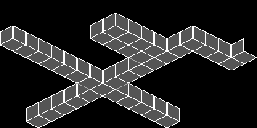

# Isometric Test Harness

https://youtu.be/ne-p3P5NYD4

I've always been a fan of the isometric view for games. It is a visually interesting projection that combines the simplicity of a top down view with a pseudo-3D aesthetic that conveys a sophisticated image without the overhead of a real 3D implementation. I figured that the LORES library might be able to pull off a simplified isometric environment, but there are a few issues to work through in order to do so.

One of the constraints of the LORES library scrolling actually works in our favor: scrolling horizontally by two pixels with the ability of scrolling vertically by one pixel matches well with the 2:1 aspect ration of an isometric tile. And that is about the only common ground between the LORES library and isometric tiles.

The LORES library is based around square 16x16 pixel tiles. Isometric tiles (technically, these aren't perfect isometric tiles) look more like flattened diamond shapes with a 2:1 aspect ratio - two pixels wide for each vertical pixel. This gives the impression of looking at a scene from a 45 degree diagonal and an elevated height. I took the approach of mapping 32x16 isometric tiles to 16x16 square tiles using a combination of modern tools and my image converter program, 'slicer', found in the MAPEDIT directory. Note that it isn't as simple as just making tiles that are twice as wide as the 16x16 LORES tiles - the isometric tiles' origin alternates from intersecting the 16x16 tile grid to halfway between the LORES tile grid. Read on to see my conversion workflow...

## Creating an Isometric Grid and Map

Watching some YouTube videos on how all the cool kids create their isometric tile maps for use in Unity, I found a very nifty program called Aseprite: https://www.aseprite.org. I went ahead and bought this tool, affordably priced at $20 for a LOT of functionality. I created my first test map using Aseprite, but realized that I could have done everything just as easily using GIMP: https://www.gimp.org. So I exported the map file over to GIMP and worked from there.

### The Isometric Grid

First, I created an isometric grid to align the 32x16 isometric tile to the 16x16 square tiles and create a guide for drawing the isometric tiles. Image layers are a powerful tool used in many image manipulation programs like Photoshop, Aseprite and GIMP. Taking advantage of this tool is very useful. I created the base layer as the isometric grid. Drawing the actual isometric tile images on transparent layers above this allows for easy edge alignment. Use as many layers as you want for floors, walls, etc. By keeping them on separate layers as you draw them makes arrangement a breeze. I also made a solid black layer just above the grid layer that I normally keep invisible so the grid shows through. By toggling its visibility, it shows me what the map looks like without the underlying grid.

### Isometric Tiles

Using layers for different tiles makes for an easy alignment process. For instance, create a floor tile that will be used many times. I will create the base tile off to the side. Once satisfied, I will select it and copy it. Then the copy can be pasted around the map using the grid as a guide. You will find my 'isotest.xcf' GIMP image file that has all the isometric tiles flattened to one layer.

## Exporting Map for Slicing and Conversion

When it's time to convert the isometric map into something digestible to LORES, set the visibility of the black background layer (or whatever color you want for the background) to 'visible' and export to a '.pnm' Portbale BitMap format using 'Raw' data values. This will be fed into the 'slicer' tool. The [slicer](../MAPEDIT/slicer.c) tool is very generic C code that should compile under just about any modern platform. It takes a Portable BitMap '.pnm' file (raw RGB values with a simple ASCII header) and converts it into a '.SET' tile set file and a '.MAP' tile map file ready to import using the LORES MAPIO functions or further editing with MAPEDIT. 'slicer' will reduce all identical tiles into one to save memory so it is important to carefully align the isometric tiles and not introduce any spurious pixels that will cause additional tiles to be generated. My command line to for conversion is:

    ../MAPEDIT/slicer -g 1.8 -n isotest

This uses a gamma of 1.8 and disabled dithering for a closest 4 BPP IRGB color match, creating 'isotest.set' and 'isotest.map' from 'isotest.pnm'.

## ISOTEST.EXE

Finally there is a test harness program to scroll around the map. It simply uses the four arrow keys to scroll along the isometric axes, quitting with the 'ESC' key. It includes two additional routines to convert between world coordinates (s,t) and screen coordinates (x,y).

## Limitations

Of course there are going to be limitations to what can be accomplished with the LORES library and what one might expect from a modern isometric implementation. Most isometric games allow characters to move behind objects and be properly occluded. LORES has no such concept, so care must be taken to keep objects/sprites always in front or hide them completely when occluded. Adding height to the tiles isn't impossible, but will take additional programming effort over what I've done here. Remeber there is a limit to the number of sprites that can be updated per frame, so don't expect to be able to implement melee of fighting sprites without clever programming & scheduling.

## Future Effects

Adding visibility to the map is one thing I would like to explore. Populating the map as the player moves through the map so the entire map isn't exposed all at once should be quite doable.
