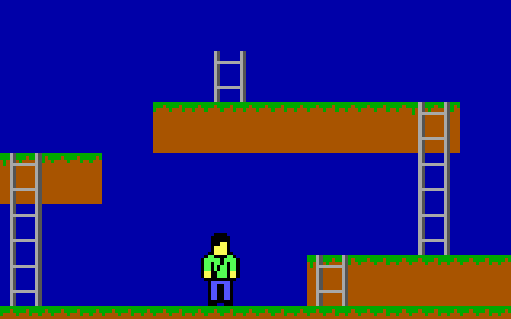

# 2D Platformer Test

https://youtu.be/fnouk6HWc_A

The most obvious use of the CGA LORES library is to create a 2D side view
platformer style game. This is a simple Lode Runner looking test to try out the
new sprite page slicer:

                Controls:
                    LEFT ARROW  - run left
                    RIGHT ARROW - run right
                    UP ARROW    - ascend ladder
                    DOWN ARROW  - descend ladder

## Implementation Details

I discovered that there is a vibrant community building Game Boy games. The
Game Boy has a graphics resolution of 160x144 which maps pretty well to the
160x100 CGA LORES resolution, at least as far as assets go. Even the tile size
of 16x16 matches the LORES tile size. So there are potentially lots of
available assets from the Game Boy development community. Look at [Game Boy
Studio](https://www.gbstudio.dev) for many ideas and great pixel artwork.

The running/climbing/falling man sprite is based of the Game Boy Kung Fu Man
available here:
https://chasersgaming.itch.io/rpg-asset-character-kung-fu-man-gameboy. This is
also a great site for assets. The
[PICO-8](https://www.lexaloffle.com/pico-8.php) is a fantasy console that has
a community of asset creators that also matches well to the LORES library.

Once again, the limitations of a 4.77 MHz CPU raises its ugly head. Even though
this sprite doesn't look very big, it really pushes the limits of the number of
pixels that can be updated during inactive video. It is a 14x23 pixel sprite
which is only 294 pixels, but that pushes our poor 8088 to its limits. If
scrolling and other sprites are going to be updated, care will have to be taken
to ensure timing doesn't cause sparkles or tearing.

However, I think it looks great.
